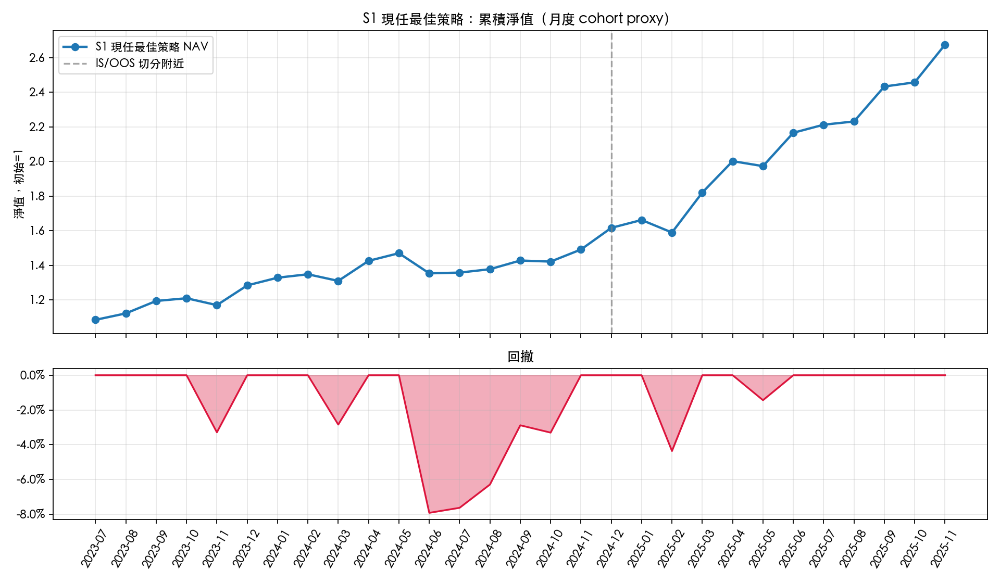
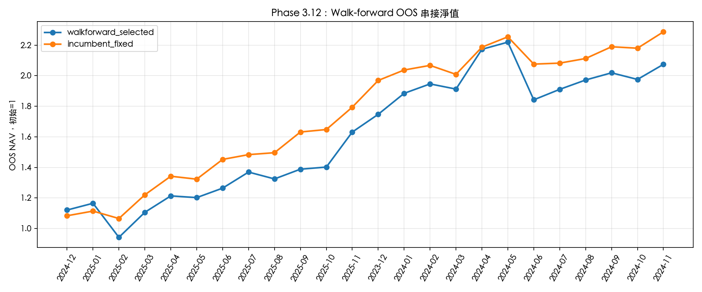
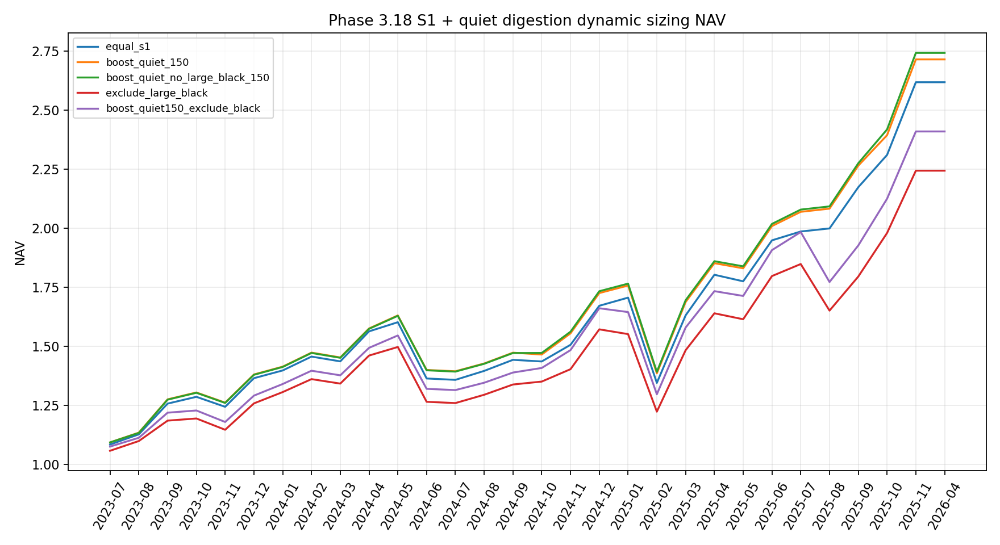

# Taiwan Monthly Revenue Surprise Strategy

**Author:** 劉晏禎 (Liu Yen-Zhen) ｜ miles891002@gmail.com  
**Subtitle:** From market-structure hypothesis to execution-aware validation for Taiwan equities  
**Version:** V6 (2026-05-26)  
**Scope:** Research / paper-trading project only. No live trading, broker connection, or investment advice.

## Executive Summary

This portfolio project studies whether Taiwan equity markets underreact to persistent monthly revenue surprise after public disclosure. Taiwan is unusually suitable for this question because listed and OTC companies disclose monthly revenue, creating a recurring public information event that can be tested systematically.

The final research framing is deliberately conservative:

> The strongest candidate is not a broad-market magic formula. It is a Taiwan electronics / semiconductor supply-chain monthly revenue surprise and fundamental momentum research candidate. It is suitable as a portfolio-grade research artifact, but not yet production-ready alpha.

## What this project demonstrates

- Building an alpha hypothesis from market structure instead of indicator mining.
- Constructing monthly revenue surprise / SUR-style factors from official data.
- Moving from simple proxy backtests to robustness gates.
- Preserving promising variants instead of overwriting them during search.
- Testing winner dependence, sector dependence, walk-forward OOS, liquidity, costs, and execution realism.
- Knowing when **not** to promote a strategy despite attractive full-sample results.

## Current status

- **Portfolio-ready research project:** Yes.
- **Production-ready trading strategy:** No.
- **Incumbent candidate:** S1 / portfolio-grade v0.1.
- **Best final interpretation:** Taiwan electronics / semiconductor monthly revenue surprise + fundamental momentum, with quiet-digestion as a research-only sizing diagnostic.

## Key headline findings

- S1 incumbent proxy result: Sharpe around `2.40`, total return around `167.5%`, MDD around `-7.9%` in the earlier portfolio-grade proxy setup.
- Fixed-20 S1 comparator: Sharpe around `1.55`, total return around `161.9%`, MDD around `-21.2%`.
- Quiet-digestion dynamic sizing improved the fixed-20 proxy only modestly: Sharpe `1.55 → 1.62`, return `161.9% → 174.4%`, MDD unchanged around `-21.2%`.
- Under conservative tradability assumptions (`next_open`, `1.0%` cost, exclude possible limit-up non-fill), quiet boost dropped to return `111.9%`, Sharpe `1.24`, MDD `-24.9%`.
- OOS / sector stress showed strong semiconductor dependence and winner concentration; therefore the strategy is not promoted as broad-market alpha.

## Project documents

### Polished Chinese portfolio deliverables (V6 = current)

- [`Taiwan_Monthly_Revenue_Strategy_Resume_Version_ZH_PRO_V6.pdf`](Taiwan_Monthly_Revenue_Strategy_Resume_Version_ZH_PRO_V6.pdf) — 履歷附件版 V6，封面新增作者資訊、KPI 條納入 FRR best diagnostic。
- [`Taiwan_Monthly_Revenue_Strategy_Talking_Guide_ZH_PRO_V6.pdf`](Taiwan_Monthly_Revenue_Strategy_Talking_Guide_ZH_PRO_V6.pdf) — 面試講稿版 V6，新增 4 題硬核挑戰性 QnA：look-ahead / data snooping、survivorship、capacity / market impact、sector regime 轉換。
- [`Taiwan_Monthly_Revenue_Strategy_Resume_Version_ZH_PRO_V6.docx`](Taiwan_Monthly_Revenue_Strategy_Resume_Version_ZH_PRO_V6.docx) — 可編輯 Word 版本。
- [`Taiwan_Monthly_Revenue_Strategy_Talking_Guide_ZH_PRO_V6.docx`](Taiwan_Monthly_Revenue_Strategy_Talking_Guide_ZH_PRO_V6.docx) — 可編輯 Word 版本。

歷史版本（V5 保留作 diff 對照）：

- [`Taiwan_Monthly_Revenue_Strategy_Resume_Version_ZH_PRO_V5.pdf`](Taiwan_Monthly_Revenue_Strategy_Resume_Version_ZH_PRO_V5.pdf)
- [`Taiwan_Monthly_Revenue_Strategy_Talking_Guide_ZH_PRO_V5.pdf`](Taiwan_Monthly_Revenue_Strategy_Talking_Guide_ZH_PRO_V5.pdf)

### Underlying research notes

1. [`01_methodology_report.md`](01_methodology_report.md) — full project narrative and research process.
2. [`02_strategy_card.md`](02_strategy_card.md) — one-page strategy card.
3. [`03_research_timeline.md`](03_research_timeline.md) — phase-by-phase evolution.
4. [`04_robustness_dashboard.md`](04_robustness_dashboard.md) — key robustness tables and interpretation.
5. [`05_execution_and_paper_trading.md`](05_execution_and_paper_trading.md) — execution realism and paper-trading plan.
6. [`06_limitations_and_next_steps.md`](06_limitations_and_next_steps.md) — honest limitations and roadmap.
7. [`07_interview_qna.md`](07_interview_qna.md) — likely interview challenges and answers.
8. [`reproducibility.md`](reproducibility.md) — scripts, reports, and how to reproduce the research artifacts.

## Selected figures







## Repository layout

```text
portfolio_project/       # Portfolio-ready narrative documents
reports/                 # Detailed phase reports and charts
data/processed/          # Processed research outputs / CSV diagnostics
scripts/                 # Research scripts for each phase
```

## Important disclaimer

This is a research project. It does not place orders, connect to a broker, or recommend live trading. Results are historical/proxy diagnostics and are subject to data timing, survivorship, execution, capacity, and regime risks.
