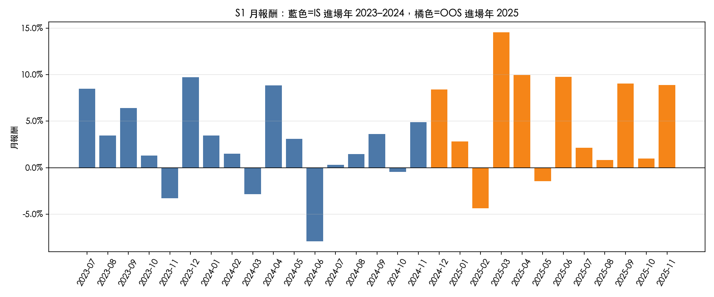
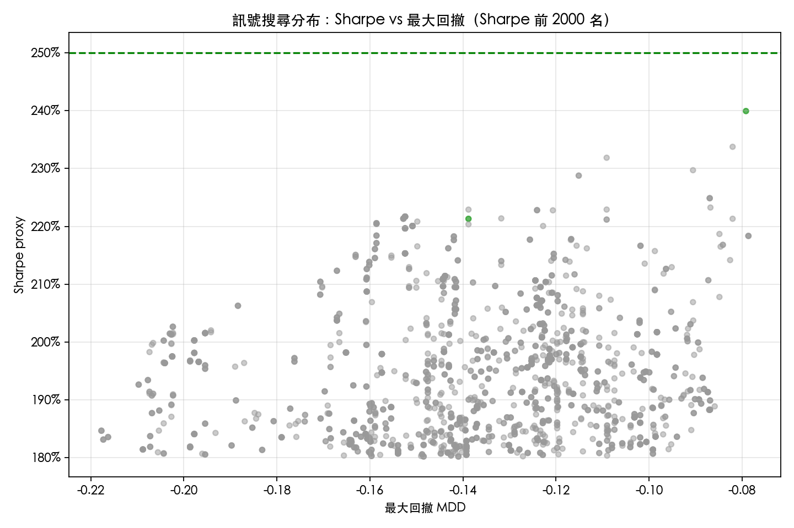
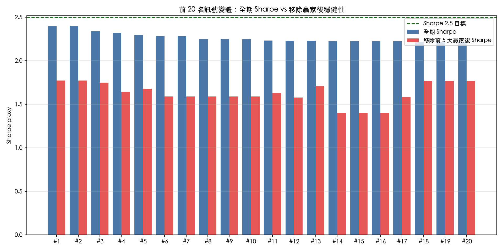
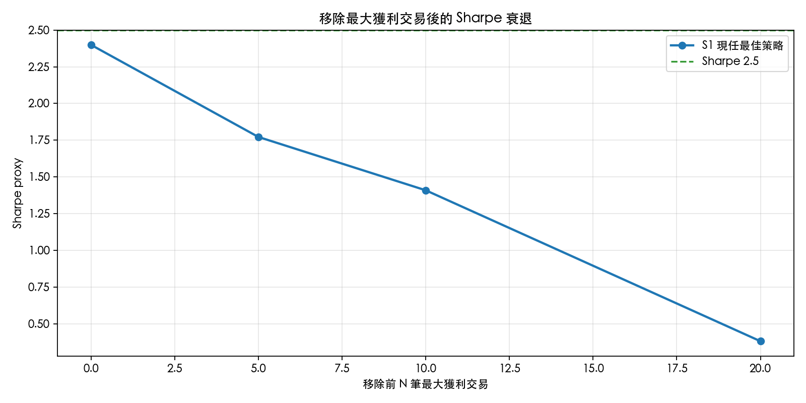
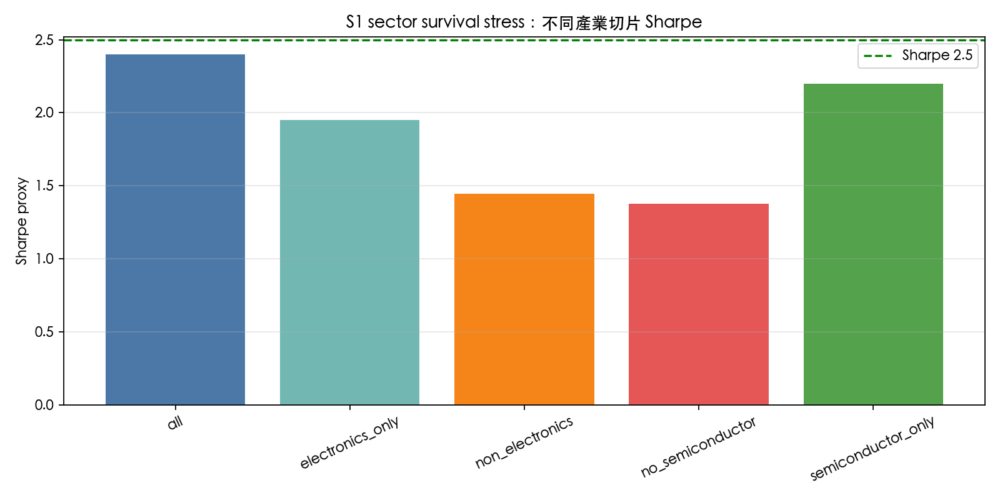
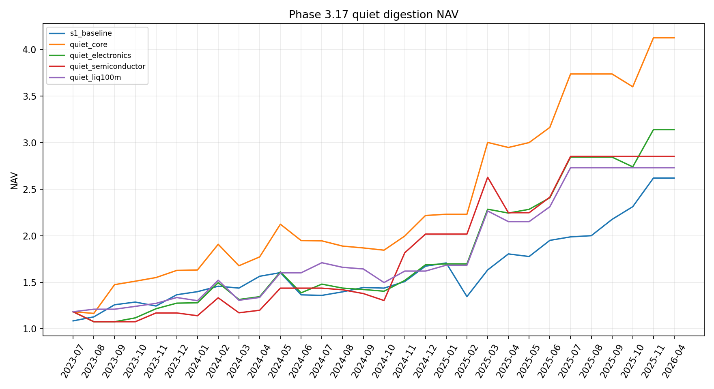

# 台股月營收驚喜策略研究作品集

**履歷附件版 / Portfolio Version**  
**專案類型：** 台股量化研究、事件驅動、基本面驚喜、短週期策略  
**狀態：** Research / Paper-trading ready；非實盤交易系統  

---

## 1. Executive Summary

本專案研究台灣上市櫃公司每月公布營收後，市場是否會對「持續性營收驚喜」反應不足，造成公布後 10–20 個交易日的短期 repricing。研究從台灣市場制度出發，建立官方資料 pipeline、SUR-style 營收驚喜因子、portfolio backtest、walk-forward OOS、sector survival、winner-dependence、成本與執行可行性檢查。

最終結論是：

> S1 是一個值得保留的 portfolio-grade v0.1 候選策略；它更像電子 / 半導體供應鏈的月營收 surprise repricing 策略，而不是廣義全市場台股 alpha。策略尚未 production-ready，下一階段應以 exact announcement timestamp、paper trading 與 execution feasibility 為主。

---

## 2. Research Hypothesis

### 核心假說

因為台灣公司每月公布營收，持續性的正向營收 surprise 會更新投資人對需求、訂單與供應鏈景氣的預期。如果市場沒有在公布後立即完全反映，則相關股票可能在接下來 10–20 個交易日出現後續 repricing。

### 為什麼不是單純技術指標？

本策略的前因後果是：

```text
月營收公告制度
→ 高頻基本面資訊更新
→ 營收 surprise / 持續性 surprise
→ 投資人延遲反應或資金逐步重新定價
→ 公布後 10–20D 短期漂移
```

---

## 3. Data and Pipeline

### 使用資料

- 台灣上市 / 上櫃月營收資料
- 每日市場資料：收盤價、成交金額
- 官方 raw daily JSON
- 解析後 OHLC / 漲跌停研究表

### 重要資料限制

目前歷史月營收資料尚未包含完整 company-level exact announcement timestamp：

```text
announcement_date_quality = monthly_summary_no_company_timestamp
```

因此研究不宣稱 same-day tradability，而是使用 delayed entry / next-open 等保守 proxy。

---

## 4. Strategy Design

### 核心訊號

```text
3M SUR persistence + not-overheated momentum
```

含義：

- 尋找連續性的營收 surprise，而不是單月高成長雜訊；
- 避免股價已經過度上漲、可能提前反映基本面的標的。

### S1 incumbent 設定

```text
sur3_high_no_high_mom | liq50m | top8 | industry_cap=3 | semi_cap=none | sl8_trail12 | 20D
```

### Portfolio construction

- 每月依月營收事件週期選股
- Top 8 names
- Industry cap = 3
- Liquidity threshold = 50m TWD
- Holding period = 20 trading days
- 加入成本、流動性與執行時點檢查

---

## 5. Headline Results

### S1 portfolio-grade v0.1 proxy

- Sharpe proxy：約 `2.40`
- Total return：約 `+167.5%`
- Max drawdown：約 `-7.9%`
- Train Sharpe：約 `1.86`
- 2025 test Sharpe：約 `3.12`
- Remove top-5 winners Sharpe：約 `1.77`
- Remove top-10 winners Sharpe：約 `1.41`

### Fixed-20 S1 comparator

- Return：`161.9%`
- Sharpe：`1.55`
- MDD：`-21.2%`
- Active months：`29/30`
- Average positions：`7.27`

---

## 6. Core Performance Charts




---

## 7. Robustness and Search Discipline

本專案不因為 full-sample Sharpe 高就提升策略。所有新版本都必須通過：

- year split
- walk-forward OOS
- remove-top-winners
- sector survival
- liquidity threshold
- cost stress
- execution timing stress

### Strategy search diagnostics







### 解讀

- 一些高報酬版本在 remove-winner 後快速衰退。
- 策略具備 right-tail dependence，因此不能只看 full-sample Sharpe。
- S1 被保留是因為它在解釋性、結果與穩健性之間相對平衡。

---

## 8. Walk-forward and Sector Survival




### 主要結論

- Walk-forward selection 沒有穩定擊敗 fixed S1。
- 策略明顯依賴電子 / 半導體供應鏈。
- No-semiconductor slice 明顯轉弱。

這代表策略應被定位為：

> 台灣電子 / 半導體供應鏈月營收 surprise repricing strategy。

而不是：

> 全市場通用台股 alpha。

---

## 9. Price-volume and Quiet Digestion Extension

後續研究測試 price-volume / K-line states，重點不是技術指標 mining，而是檢查月營收 surprise 後的市場消化型態。

### Quiet digestion hypothesis

```text
高 3M SUR + 未過熱 momentum + 低異常成交量 + 窄幅 K 線
```

直覺：

> 好營收公布後，股價沒有爆量追高，而是低量整理，可能代表市場仍在消化資訊；若基本面 surprise 真實，後續仍可能 repricing。




### 結論

Quiet digestion 作為 standalone strategy 交易數偏少且 winner-dependent，因此沒有被提升為主策略；比較適合保留為 S1 的 research-only sizing hypothesis。

---

## 10. Execution Realism

### Conservative execution proxy

```text
next_open + 1.0% cost + exclude possible limit-up risk
```

結果：

- Equal S1：return `99.8%`，Sharpe `1.16`，MDD `-26.2%`
- Quiet boost：return `111.9%`，Sharpe `1.24`，MDD `-24.9%`

### 解讀

保守執行假設下結果仍為正，但 headline quality 顯著下降。這是為什麼目前只能稱為 portfolio-grade research candidate，而非 production-ready strategy。

---

## 11. Paper-trading Plan

下一階段應進入 paper trading，並記錄：

- data_observed_at
- signal_generated_at
- planned_entry_date
- planned_entry_type
- actual observable open/high/low/close
- limit-up / non-fill reason
- ADV participation
- estimated slippage
- paper fill price
- 5D / 10D / 20D return
- deviation from backtest assumptions

Paper trading 的目的不是證明 alpha，而是驗證：

> 回測假設能不能在真實資料更新與交易制度下被執行。

---

## 12. Key Limitations

1. Exact announcement timestamp 尚未完整取得。
2. Survivorship / historical universe controls 仍需加強。
3. Execution simulation 尚未達到 order-book / auction-level。
4. 樣本期間偏短，主要是 2023–2025。
5. Sector dependence 明顯，特別是半導體 / 電子。
6. Winner concentration 仍是核心風險。

---

## 13. What This Project Demonstrates

這個專案展示我能夠：

- 從市場制度提出可檢驗的 alpha hypothesis；
- 使用官方資料建立量化研究 pipeline；
- 設計 SUR-style fundamental surprise 因子；
- 建立 portfolio-level backtest；
- 執行 OOS、sector、winner、cost、liquidity、execution robustness；
- 誠實拒絕尚未通過 gate 的策略；
- 將研究推進到 paper-trading specification。

---

## 14. Final Positioning

最適合放在履歷 / portfolio 的一句話：

> Built a Taiwan monthly-revenue surprise research pipeline using official data, SUR-style fundamental surprise factors, walk-forward and sector robustness tests, and execution-aware paper-trading design; identified a portfolio-grade electronics/semiconductor supply-chain repricing candidate while explicitly rejecting production-readiness due to timing, survivorship, execution, and concentration risks.

中文版：

> 建立台股月營收 surprise 量化研究流程，使用官方資料與 SUR-style 基本面驚喜因子，完成 walk-forward、sector survival、winner-dependence、成本與執行可行性檢查；保留一個 portfolio-grade 的電子 / 半導體供應鏈 repricing 候選策略，但明確不宣稱 production-ready。
